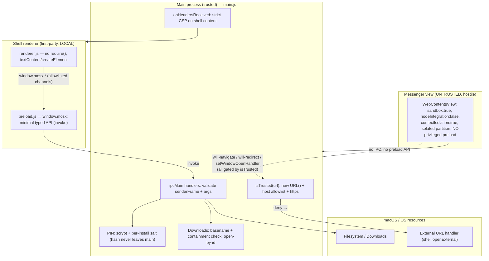

# Harden Electron Security and Finalize macOS (Apple Silicon) Build

## Overview

Mosx is an Electron wrapper that embeds Facebook Messenger (untrusted third‑party web content) inside a local app shell, with multi‑account session isolation, badges, download handling, and a PIN app‑lock. The macOS runtime port (dock badge, `Cmd+Shift+M` hotkey, macOS user agent, `.icns`, dmg build) already landed — see the completed [2026-05-05 migration plan](docs/plans/2026-05-05-001-feat-macos-pnpm-migration-plan.md).

This plan addresses the second half of the request: **eliminate all security issues, with a hard requirement of no remote code execution (RCE)**, and finalize a secure, distributable build for Apple Silicon (arm64). It treats the app as a security engineer would: the embedded Messenger view is hostile, and every path from it into the app shell or the OS is a trust boundary to be defended.

The work eliminates **two independent RCE surfaces** and hardens the trust boundary between the local shell and the embedded web content.

## Problem Frame

The app currently violates nearly every item on the official Electron security checklist. Concretely, there are two distinct RCE surfaces:

- **(A) Application‑layer XSS→RCE.** The main shell window runs with `nodeIntegration: true` + `contextIsolation: false` and **no Content‑Security‑Policy**. Its renderer (`renderer.js`) `require()`s `electron`/`fs`/`path`/`crypto` directly and builds DOM via `innerHTML` from a **downloaded file's filename** ([renderer.js:860](renderer.js), [renderer.js:796](renderer.js), [renderer.js:890](renderer.js)) and injects a file save‑path into inline `onclick="ipcRenderer.send(...)"` attributes ([renderer.js:847](renderer.js), [renderer.js:850](renderer.js)). A filename is attacker‑controlled (Content‑Disposition on a file shared through Messenger). A name like `` therefore executes arbitrary Node in a full‑privilege renderer → **full RCE on the user's Mac**.
- **(B) Engine‑layer RCE.** The app pins **Electron 29.4.6, which reached end‑of‑life on 2024‑08‑20** and has received no Chromium/V8/Node security backports for ~2 years. Publicly known Chromium/V8 RCE CVEs disclosed since then are unpatched in the bundled engine. A "no RCE" mandate is not satisfiable while shipping an EOL engine.

Additional trust‑boundary defects compound the risk: origin checks use bypassable substring matching (`url.includes("facebook.com")`), there are no `will-navigate`/`will-redirect` guards, `shell.openExternal` is called on unvalidated URLs, a privileged preload bridge (`messengerApp.getSettings`, which returns the app‑lock **PIN hash**) is exposed to the untrusted Messenger views, downloads are written using an unsanitized filename (`path.join(downloadsPath, filename)` → path traversal), and the PIN is a 4‑digit value hashed with `sha256(pin + "_mosx_salt_2026")` — a constant, in‑source salt that is trivially brute‑forced.

## Requirements Trace

- **R1.** App runs and builds natively on macOS Apple Silicon (arm64). *(runtime port done; finalize arm64 + secure build)*
- **R2.** Eliminate application‑layer RCE: shell renderer runs with `contextIsolation: true`, `nodeIntegration: false`, `sandbox: true`, a strict CSP, and no HTML/attribute‑injection sinks.
- **R3.** Eliminate engine‑layer RCE: run a supported Electron major (target 43, minimum 42).
- **R4.** Enforce the shell↔Messenger trust boundary: parsed‑host origin allowlist, navigation guards, deny‑by‑default permissions, validated `openExternal`, IPC sender validation, no privileged preload on untrusted views, `sandbox: true` on those views.
- **R5.** Protect sensitive local data: PIN hash never leaves the main process, PIN uses a real KDF with a per‑install random salt, and downloads cannot escape the Downloads directory or open arbitrary paths.
- **R6.** Produce a secure, notarizable distributable: hardened runtime, Developer ID signing, notarization, arm64 dmg; auto‑update only applies signed builds.
- **R7.** Remove Windows‑only code paths (the app is macOS‑only per the request), reducing dead code and attack surface.

## Scope Boundaries

- Not adding new product features — this is security hardening + platform finalization only.
- Not changing multi‑account behavior, badges, privacy toggles (block seen/typing), theming, or the download UX — only how they are implemented safely.
- Not supporting Windows or Intel macs. arm64 only. (Windows‑only code is removed, not maintained.)
- Not re‑implementing the Messenger scraping logic (avatar/unread `executeJavaScript`) — but its outputs are treated as untrusted and rendered safely.

### Deferred to Separate Tasks

- **Apple Developer account provisioning** (Developer ID cert, App Store Connect API key): an operational prerequisite for Unit 7's signing/notarization; obtained out‑of‑band, not a code change.
- **Full per‑major Electron breaking‑change audit (29→43):** the migration unit (Unit 6) verifies each major's breaking‑changes page during implementation; this plan captures only the known‑impactful ones.

## Context & Research

### Relevant Code and Patterns

- [main.js:596](main.js) — shell `BrowserWindow` `webPreferences`: `nodeIntegration: true`, `contextIsolation: false` (the RCE substrate).
- [main.js:739](main.js), [main.js:786](main.js) — Messenger `BrowserView`s: correctly `contextIsolation: true` / `nodeIntegration: false`, but attach `preload.js` (privileged) and lack `sandbox: true`.
- [main.js:395](main.js) — `setWindowOpenHandler` using `url.includes(...)`; [main.js:661](main.js)/[main.js:685](main.js) — permission handlers using `.includes(...)`.
- [main.js:342](main.js) — `will-download`: `path.join(downloadsPath, item.getFilename())` (traversal); [main.js:940](main.js) — `open-download-file` does `shell.openPath` on a renderer‑supplied path.
- [main.js:914](main.js) — `get-settings` IPC returns `appLockHash`; [preload.js:3](preload.js) — `messengerApp.getSettings` exposes it to untrusted views.
- [renderer.js:1](renderer.js) — `require("electron")`; [renderer.js:453](renderer.js)/[renderer.js:470](renderer.js) — `require("crypto")` + `hashPin` (constant salt); [renderer.js:377](renderer.js) — direct `shell.openExternal`.
- Existing good pattern to mirror: per‑profile `session.fromPartition(profile.partition)` isolation, `webRequest.onBeforeRequest` filtering ([main.js:607](main.js)), and the `process.platform === "darwin"` branches already in the codebase.

### Institutional Learnings

- `docs/solutions/` is empty — no prior institutional learnings to carry forward. This plan's outcomes are a candidate for `ce:compound` after implementation.

### External References

Both grounded by parallel research against official Electron docs and reputable Electron‑security write‑ups (verified July 2026):

- **Electron support/EOL:** Electron supports only the latest 3 stable majors. **29 is EOL (2024‑08‑20)**; current stable **43** (Chromium M150 / Node 24, supported to 2027‑01‑05); 42 acceptable; 41 exits support ~2026‑08‑25. — https://endoflife.date/electron , https://releases.electronjs.org/schedule
- **Electron Security checklist (20 items):** contextIsolation, nodeIntegration:false, sandbox:true, webSecurity, CSP via `session.webRequest.onHeadersReceived` (preferred over `<meta>`), `will-navigate`/`will-redirect`, `setWindowOpenHandler` deny‑by‑default, `openExternal` validation, permission handlers, IPC `sender` validation, fuses, current Electron. — https://www.electronjs.org/docs/latest/tutorial/security
- **Origin validation:** substring/`startsWith`/`includes` are explicitly called out as broken (`https://example.com.attacker.com`); parse with WHATWG `URL` and match the parsed `hostname` against an exact allowlist. — Electron security item 13.
- **BrowserView deprecated (E30) → WebContentsView.** API mapping: `win.contentView.addChildView/removeChildView`, `win.contentView.children`; `setAutoResize` removed (reimplement via window `resize`); opaque‑white default background. `File.path` removed in favor of `webUtils.getPathForFile()`. — https://www.electronjs.org/blog/migrate-to-webcontentsview
- **electron-builder:** 24.13.3 is outdated; use **26.15.x** (built‑in `mac.notarize` via notarytool). Config: `mac.target:[{target:"dmg",arch:["arm64"]}]`, `hardenedRuntime:true` (default), `gatekeeperAssess:false`, `entitlements`/`entitlementsInherit`, `notarize`. Entitlements: `com.apple.security.cs.allow-jit`, `com.apple.security.cs.allow-unsigned-executable-memory`, `com.apple.security.network.client` (+ `disable-library-validation` only if loading unsigned native libs). — https://www.electron.build/docs/mac/ , https://www.electron.build/docs/features/code-signing/notarization/
- **Real‑world Electron RCE chains** (Discord/Element post‑mortems): isolated partition per untrusted view, no shared JS context, `sandbox:true` as the single highest‑value change for third‑party content. — SecureLayer7 / DeepStrike Electron pentest write‑ups.

## Key Technical Decisions

- **Fix both RCE surfaces, sequenced in two phases.** Phase 1 (app‑code hardening) removes surface (A) and works on the current Electron 29, so the critical fixes ship without waiting on the risky engine upgrade. Phase 2 removes surface (B) and delivers a secure build. Both are required for "no RCE"; Phase 1 is the higher priority and lands first.
- **Treat the Messenger view as fully hostile.** All defenses assume its JS is attacker‑controlled: no privileged preload, `sandbox:true`, isolated partition (already per‑profile), navigation and `openExternal` mediated and validated in the main process.
- **Minimal typed `contextBridge` API; never expose `ipcRenderer`/`require`.** The shell gets a dedicated preload exposing only the specific channels it uses; the removal of global `ipcRenderer` is what structurally kills the inline‑`onclick` injection.
- **CSP via response header, not `<meta>`,** applied to the shell's local content: `default-src 'self'; script-src 'self'; object-src 'none'; base-uri 'none'`. No `unsafe-inline` for scripts. (Style handled by extracting the inline `<style>` block to a file so `style-src 'self'` can stay strict; see Unit 2.)
- **Parsed‑host allowlist, not substring.** One shared validator (`new URL()` → exact/`.endsWith('.facebook.com')` on the parsed hostname + `https:` protocol assertion) reused across window‑open, permissions, navigation, and `openExternal`.
- **PIN verification moves to the main process.** The renderer sends the candidate PIN over IPC; main compares against a stored hash and returns a boolean. The hash never reaches any renderer. Upgrade hashing to `scrypt` (or PBKDF2) with a per‑install random salt.
- **Upgrade to Electron 43 (not 42).** 43 has the longest support runway (to 2027‑01‑05); 41/42 age out within months. Migrate `BrowserView`→`WebContentsView` as part of the same unit since 43 keeps `BrowserView` only on the deprecation path.
- **Upgrade electron‑builder to 26.15.x** (not the early 26.0.x, which had node‑module‑collector regressions; not v27, which requires ESM/Node 22.12) for current notarization handling.
- **Remove Windows code rather than guard it.** The request is macOS‑only; dead `win32` branches (`setOverlayIcon`, `createBadgeIcon`, Windows UA, tray label) are deleted to shrink the surface.

## Open Questions

### Resolved During Planning

- **Is macOS support already implemented?** Yes — the prior migration plan is complete (dock badge, hotkey, UA, icns, dmg). This plan finalizes the *secure* arm64 build and does not redo runtime porting.
- **Which Electron version?** 43 (see decision above).
- **Can Phase 1 ship on Electron 29?** Yes — contextIsolation/sandbox/CSP/allowlist are all available in 29. Only Phase 2 changes the engine.
- **Does the shell renderer actually need Node?** No. `fs`/`path` are imported but unused; `crypto.randomUUID` → `self.crypto.randomUUID()` (Web Crypto); PIN hashing moves to main; `shell.openExternal` becomes an IPC call. All `require()`s can be removed.

### Deferred to Implementation

- **Exact per‑major Electron breaking changes (29→43)** for `session`/`webRequest`/`setPermissionRequestHandler`/`contextBridge`: no known break, but verify each major's breaking‑changes page during Unit 6.
- **Exact fuse set for Electron 43** (`runAsNode`, `nodeCliInspect`, `onlyLoadAppFromAsar`, cookie encryption): finalize against the landed version in Unit 6.
- **`File.path` → `webUtils.getPathForFile()`** exact call site wiring for the avatar picker ([renderer.js:235](renderer.js)) — resolved when Unit 6 lands the API.
- **Notarization credential mechanism** (App Store Connect API key vs Apple ID app‑specific password): chosen at signing setup time (Unit 7).

## High-Level Technical Design

> *This illustrates the intended trust‑boundary architecture and is directional guidance for review, not implementation specification. The implementing agent should treat it as context, not code to reproduce.*

## Implementation Units

### Phase 1 — Application-layer hardening (removes RCE surface A; ships on Electron 29)

- [ ] **Unit 1: Shell window isolation + preload bridge + de-Node the renderer**

**Goal:** Flip the main window to the secure isolation trio, introduce a minimal typed preload bridge, and remove all Node usage from `renderer.js` so a DOM/attribute injection can no longer reach Node.

**Requirements:** R2, R5

**Dependencies:** None

**Files:**
- Modify: `main.js` (shell `webPreferences` → `contextIsolation: true`, `nodeIntegration: false`, `sandbox: true`, add `preload`; new/adjusted IPC handlers for `openExternal` and PIN verify; stop returning `appLockHash` from `get-settings`)
- Modify: `preload.js` (repurpose into the **shell** bridge: `contextBridge.exposeInMainWorld('mosx', {...})` exposing only the channels the shell uses, via `ipcRenderer.invoke`/scoped `on`; strip the `messengerApp`/`getSettings` surface)
- Modify: `renderer.js` (remove `require("electron"|"fs"|"path"|"crypto")`; replace `ipcRenderer.*` with `window.mosx.*`; `crypto.randomUUID()` → `self.crypto.randomUUID()`; move PIN hashing/verification to main via `window.mosx`; replace direct `shell.openExternal` with `window.mosx.openExternal`)
- Modify: `index.html` (convert the single inline `onclick` to an `addEventListener` in `renderer.js`)

**Approach:**
- Expose a small, explicit API (e.g. `window.mosx.switchProfile`, `logoutProfile`, `verifyPin`, `setupPin`, `getUiSettings`, `openExternal`, `onDownloadStarted/Progress/Done`, etc.). Each renderer‑callable action maps to one named channel; no generic passthrough. Back it with a `.d.ts` for typing.
- Prefer `ipcRenderer.invoke`/`ipcMain.handle` (async) over `send`/`sendSync`. `getUiSettings` returns only non‑sensitive UI fields (dark mode, alwaysOnTop, lock enabled/timeout) — **never** the hash.
- PIN: `window.mosx.setupPin(pin)` and `window.mosx.verifyPin(pin)` send the raw candidate; main hashes/compares (hashing upgrade itself is Unit 5, but the IPC contract moves here).
- The download‑action buttons' inline `onclick` handlers are removed here in spirit but their safe re‑rendering lands in Unit 2 (they share the same `renderDownloads` rewrite).

**Patterns to follow:** Electron `contextBridge` official example; the existing per‑channel `ipcMain.on` handlers in [main.js](main.js).

**Test scenarios:**
- Happy path: app launches; sidebar renders; switching profiles, dark‑mode toggle, zoom, reload, always‑on‑top, and the donate link all still work through `window.mosx`.
- Happy path: creating a profile still generates a UUID (`self.crypto.randomUUID()`).
- Edge case: `window.mosx` exposes no `require`, no `ipcRenderer`, no `fs`; `typeof window.require === 'undefined'` in the shell renderer.
- Error path: a renderer call with a bad/missing argument is rejected by the main handler without crashing.
- Security: `get-settings`/`getUiSettings` response contains no `appLockHash` field.

**Verification:** Shell renderer has zero `require()` calls; `webPreferences` shows the isolation trio; all shell UI actions function; DevTools console shows no `ReferenceError` for removed Node globals.

- [ ] **Unit 2: Content-Security-Policy + eliminate HTML/attribute-injection sinks**

**Goal:** Add a strict CSP to the shell's local content and rebuild all data‑bearing DOM without `innerHTML` or inline handlers, closing the XSS→RCE injection at its source and with defense‑in‑depth.

**Requirements:** R2

**Dependencies:** Unit 1

**Files:**
- Modify: `main.js` (add `session.webRequest.onHeadersReceived` on the shell content session, injecting `Content-Security-Policy`)
- Modify: `renderer.js` (rewrite `renderDownloads` [renderer.js:801](renderer.js), `showDlToast` [renderer.js:795](renderer.js), `renderSidebar` [renderer.js:123](renderer.js), and the logout‑button updates [renderer.js:306](renderer.js) to use `textContent`/`createElement`/`setAttribute` + `addEventListener`)
- Modify: `index.html` (extract the inline `<style>` block to a first‑party CSS file so `style-src 'self'` can remain strict; no inline scripts/handlers)
- Create: `shell_style.css` (the extracted styles) *(optional — only if extracting rather than allowing `style-src 'unsafe-inline'`)*

**Approach:**
- CSP: `default-src 'self'; script-src 'self'; object-src 'none'; base-uri 'none'; frame-src 'self' https:` (adjust `img-src` to allow `https:`/`data:` for avatars). Apply only to the shell's local `index.html` content, **not** to the Messenger views (their CSP is Facebook's; isolation is the control there — Unit 4).
- Download list: build each row with `createElement`; set filename via `textContent` (never `innerHTML`); attach button handlers with `addEventListener` calling `window.mosx.openDownloadFile(id)` etc. — **pass the download id, not a path** (path lookup happens main‑side, Unit 5).
- Toast: `textContent` for the filename portion.

**Patterns to follow:** existing `document.createElement` usage already present in `renderSidebar` ([renderer.js:126](renderer.js)).

**Test scenarios:**
- Security (the core RCE test): a download whose filename is `">` renders as **inert visible text**, fires no `onerror`, and executes no script (verified with CSP violation report + no alert).
- Security: a filename containing a single quote / `);` cannot break out of any handler (there are no inline handlers left).
- Happy path: normal filenames, progress %, size, and the open/open‑folder/cancel buttons work.
- Edge case: CSP blocks an injected `<script>` and an inline event handler (observe `Content-Security-Policy` violation in console).
- Edge case: avatars (`https://scontent...`, `graph.facebook.com`) still load under `img-src`.

**Verification:** No `innerHTML` assignment in `renderer.js` receives untrusted data; CSP header present on the shell document; malicious‑filename payload is inert.

- [ ] **Unit 3: Trust-boundary hardening — origin allowlist, navigation guards, openExternal, permissions, IPC sender validation**

**Goal:** Replace all bypassable substring origin checks with a single parsed‑host validator and apply it consistently across every boundary where untrusted content can act.

**Requirements:** R4

**Dependencies:** Unit 1 (shares the new `openExternal` IPC handler)

**Files:**
- Modify: `main.js`

**Approach:**
- Add one `isTrusted(url)` helper: `new URL(url)` (try/catch), require `protocol === 'https:'`, and `hostname` exact‑match against an allowlist (`facebook.com`, `www.facebook.com`, `m.facebook.com`, `messenger.com`, `www.messenger.com`) or parsed‑host `.endsWith('.facebook.com')`/`.endsWith('.fbcdn.net')`.
- `setWindowOpenHandler` ([main.js:395](main.js)): allow in‑app only if `isTrusted`; otherwise route to the validated `safeOpenExternal` and `deny`.
- `safeOpenExternal(url)`: parse; permit only `http:`/`https:`/`mailto:`; reject `file:`, `data:`, `javascript:`, UNC, and custom schemes. Used by the window‑open handler and the context‑menu link items ([main.js:433](main.js), [main.js:439](main.js)).
- Add `will-navigate` **and** `will-redirect` on each Messenger `webContents`: `preventDefault()` any navigation whose target fails `isTrusted`.
- `setPermissionRequestHandler`/`setPermissionCheckHandler` ([main.js:661](main.js), [main.js:685](main.js)): gate on `isTrusted(webContents.getURL())`; keep the deny‑by‑default allowlist of permissions.
- `ipcMain` handlers: validate `event.senderFrame` origin (must be the local shell for shell channels) and normalize/validate all arguments; reject otherwise.

**Patterns to follow:** Electron security items 13/14/15/17; the existing permission allowlist array ([main.js:668](main.js)).

**Test scenarios:**
- Security: `https://evil.com/facebook.com`, `https://facebook.com.evil.com`, and `http://facebook.com` (non‑https) are all **denied** by `isTrusted` (window‑open, navigation, permissions).
- Security: `shell.openExternal` is invoked for `https://…` but **not** for `file:///etc/passwd`, `smb://…`, `javascript:…`, or a custom‑scheme URL.
- Security: a `will-redirect` to a non‑allowlisted origin is prevented.
- Security: a forged IPC message from a non‑shell frame is rejected.
- Happy path: legitimate Messenger navigation, notifications/mic/camera permission prompts, and external `https` links still work.
- Error path: a malformed URL string does not throw (caught, treated as untrusted).

**Verification:** No `.includes(` origin check remains in `main.js`; all four boundaries call the shared validator; manual attempts with the payloads above are blocked.

- [ ] **Unit 4: Isolate the untrusted Messenger views (sandbox, no privileged preload, partition hygiene)**

**Goal:** Ensure the embedded Messenger content has the least possible privilege — no app IPC, no Node, sandboxed, and no access to the PIN hash.

**Requirements:** R4, R5

**Dependencies:** Unit 1 (preload.js repurposed to shell‑only), Unit 3 (validator)

**Files:**
- Modify: `main.js` (remove `preload` from both `BrowserView`/view `webPreferences` at [main.js:742](main.js) and [main.js:788](main.js); add `sandbox: true`; keep `contextIsolation: true`/`nodeIntegration: false`; keep per‑profile `partition`)
- Modify: `preload.js` (ensure it is attached only to the shell window, never the Messenger views)

**Approach:**
- The Messenger views need zero app IPC → give them **no preload** at all. This deletes the `messengerApp.getSettings` PIN‑hash exposure entirely.
- Add `sandbox: true` to the Messenger view `webPreferences` (highest‑value change for third‑party content; disables Node in that renderer and limits any V8 memory bug).
- Confirm each profile keeps its own `session.fromPartition(profile.partition)` (already the case) so cookies/permissions/storage stay isolated across accounts and from the shell.
- Verify the avatar/unread `executeJavaScript` scraping still runs (it runs in the page world and returns primitive values that are treated as untrusted downstream — safe rendering is Unit 2).

**Patterns to follow:** Electron "Web Embeds" isolated‑partition guidance; SecureLayer7 remediation (separate views, no shared JS context).

**Test scenarios:**
- Security: in a Messenger view, `window.messengerApp` and `window.mosx` are both `undefined`; `window.require` is `undefined`.
- Security: Messenger view JS cannot read the PIN hash by any exposed API.
- Edge case: two profiles do not share cookies/localStorage (log into account A, account B remains separate).
- Happy path: Messenger loads, notifications/media work, avatar and unread badge scraping still update, block‑seen/block‑typing still function.
- Integration: `sandbox: true` does not break the `will-download` handler or `webRequest` filtering on the partition session.

**Verification:** Messenger views have `sandbox:true` and no `preload`; no privileged global is reachable from the view; multi‑account isolation intact.

- [ ] **Unit 5: Harden the download pipeline (path traversal + arbitrary open)**

**Goal:** Prevent a malicious filename from writing outside Downloads or causing an arbitrary path to be opened.

**Requirements:** R5

**Dependencies:** Unit 1 (id‑based download IPC), Unit 2 (renderer passes id, not path)

**Files:**
- Modify: `main.js` (`will-download` [main.js:342](main.js): sanitize; `open-download-file`/`open-download-folder` [main.js:940](main.js): resolve by id + containment re‑check)

**Approach:**
- Sanitize: `const safe = path.basename(rawName).replace(/[/\\]/g,'') || 'download'`, then `const dest = path.resolve(path.join(downloadsDir, safe))`, then assert `dest.startsWith(path.resolve(downloadsDir) + path.sep)`; on failure fall back to a fixed safe name. Also handle percent‑encoded / non‑UTF‑8 names.
- Track `id → sanitized absolute savePath` in the existing `activeDownloads`/a completed map. IPC `openDownloadFile(id)`/`openDownloadFolder(id)` look up the path by id, re‑assert containment, then `shell.openPath`/`showItemInFolder` — never accept a renderer‑supplied path.

**Patterns to follow:** the existing `activeDownloads` Map ([main.js:28](main.js)); Consensys IPFS‑Desktop path‑traversal remediation.

**Test scenarios:**
- Security: a download named `../../../../Users/x/evil.command` is written into Downloads as a flat basename, never outside it.
- Security: an IPC `openDownloadFile` with an id that has no tracked path, or a path that fails containment, is rejected (no `shell.openPath`).
- Happy path: a normal download saves to Downloads and open/open‑folder work.
- Edge case: empty/only‑separators filename falls back to `download`.
- Edge case: duplicate filenames don't overwrite silently (append/rename) — confirm behavior is acceptable.

**Verification:** All save paths are contained in Downloads; open actions accept only ids and re‑validate; traversal payload is neutralized.

### Phase 2 — Platform currency & secure Apple-Silicon build (removes RCE surface B)

- [ ] **Unit 6: Upgrade Electron 29 → 43 and migrate BrowserView → WebContentsView**

**Goal:** Run a supported engine (closing ~2 years of unpatched Chromium/V8 CVEs) and migrate off the deprecated `BrowserView`.

**Requirements:** R3, R1

**Dependencies:** Phase 1 complete (harden first, then move the engine under hardened config)

**Files:**
- Modify: `package.json` (`electron` → `43.x` exact; `.nvmrc`/`engines` already Node 24 — confirm compatibility)
- Modify: `main.js` (`new BrowserView(...)` → `new WebContentsView(...)`; `setBrowserView`/`getBrowserView` → `win.contentView.addChildView`/`removeChildView`/`children`; reimplement any `setAutoResize` via the window `resize` event; set view background to transparent if needed; verify `session`/`webRequest`/permission/`contextBridge` APIs unchanged; set desired fuses)
- Modify: `renderer.js` (avatar picker `File.path` [renderer.js:235](renderer.js) → `webUtils.getPathForFile(file)` exposed via preload)
- Modify: `preload.js` (expose a `getPathForFile` wrapper if needed for the avatar picker)

**Approach:**
- Bump Electron to 43, `pnpm install`, and walk each intervening major's breaking‑changes page for the APIs in use (deferred‑questions list). Land the `WebContentsView` migration in the same change since 29→43 crosses the deprecation.
- Reapply the security `webPreferences` (isolation trio for shell; sandbox/no‑preload for Messenger views) to the new view objects — they carry the same `webPreferences` shape.
- Finalize the fuse set (`runAsNode` off, `nodeCliInspect` off, `onlyLoadAppFromAsar` on, cookie encryption on) per Electron 43.

**Execution note:** Characterize current behavior first — this is a 14‑major jump touching view lifecycle; add a manual smoke checklist (below) and run it before and after to catch regressions.

**Test scenarios:**
- Happy path: app launches on Electron 43 on arm64; profiles, switching, badges, downloads, hotkey, dock badge, tray, block‑seen/typing all work.
- Integration: view resize/maximize/fullscreen keeps the Messenger view correctly bounded (the reimplemented resize logic).
- Edge case: avatar picker returns a valid local path via `webUtils.getPathForFile` (not `undefined`).
- Security: the isolation/sandbox settings from Phase 1 are present on the migrated `WebContentsView`s (regression guard).
- Error path: no uncaught exceptions in main or renderer consoles on launch and profile switch.

**Verification:** `electron` is a supported major; no `BrowserView` references remain; smoke checklist passes; Phase‑1 security settings intact on the new views.

- [ ] **Unit 7: Secure, notarizable arm64 build (electron-builder 26, hardened runtime, signing, notarization)**

**Goal:** Produce a signed, notarized, hardened arm64 `.dmg`, and ensure auto‑update only applies signed builds.

**Requirements:** R6, R1

**Dependencies:** Unit 6 (build against the upgraded Electron); Apple Developer provisioning (deferred/operational)

**Files:**
- Modify: `package.json` (`electron-builder` → `26.15.x`; `build.mac` → `target:[{target:"dmg",arch:["arm64"]}]`, `hardenedRuntime:true`, `gatekeeperAssess:false`, `entitlements`/`entitlementsInherit` paths, `notarize:true`)
- Create: `build/entitlements.mac.plist` (`com.apple.security.cs.allow-jit`, `com.apple.security.cs.allow-unsigned-executable-memory`, `com.apple.security.network.client`)

**Approach:**
- Signing/notarization credentials via env (App Store Connect API key preferred: `APPLE_API_KEY`/`APPLE_API_KEY_ID`/`APPLE_API_ISSUER`) — never committed.
- Add `disable-library-validation` **only if** a build error proves an unsigned native module needs it; otherwise omit (least privilege).
- Auto‑updater: with Developer ID signing + notarization, `electron-updater` verifies the update signature. Confirm updates only apply signed artifacts; if signing is not yet provisioned, keep auto‑apply disabled (manual "check for updates" that opens the release page is acceptable) to avoid an unsigned‑update RCE path.

**Test expectation: none for unit logic** — this is build/config. Verification is artifact‑based (below).

**Verification:**
- `pnpm run build` produces `dist/Mosx-<ver>-mac.dmg` (arm64).
- `codesign --verify --deep --strict --verbose=2 <app>` passes; `spctl -a -vvv <app>` reports accepted/notarized; `stapler validate` passes.
- Hardened runtime flag present (`codesign -d --entitlements - <app>` shows the JIT entitlements).
- App launches from the mounted dmg on a clean arm64 Mac without Gatekeeper blocking.

- [ ] **Unit 8: Remove Windows-only code and add a minimal macOS application menu**

**Goal:** Delete dead Windows paths (macOS‑only app) and restore standard macOS edit/quit keyboard shortcuts.

**Requirements:** R7, R1

**Dependencies:** None (can land anytime; low risk)

**Files:**
- Modify: `main.js` (remove `setAppUserModelId`/`win32` guard [main.js:49](main.js); remove `setOverlayIcon` win32 branch + `createBadgeIcon` [main.js:104](main.js)/[main.js:968](main.js); Windows UA branch [main.js:39](main.js); tray "Khởi động cùng Windows" branch [main.js:180](main.js); replace `Menu.setApplicationMenu(null)` [main.js:1011](main.js) with a minimal native menu providing standard `editMenu`/`Cmd+Q`/copy/paste/select‑all roles)

**Approach:**
- Keep only the `darwin` behavior in each former platform branch.
- `Menu.setApplicationMenu(null)` currently strips the macOS app menu, which disables `Cmd+C/V/A` and `Cmd+Q` inside the Messenger view — build a small menu with the standard `{role:'appMenu'}`/`{role:'editMenu'}` templates instead (this is a macOS correctness fix, not a feature).

**Test scenarios:**
- Happy path: `Cmd+C`, `Cmd+V`, `Cmd+A`, `Cmd+Q` work inside the Messenger view.
- Edge case: dock badge (macOS) still updates unread count; tray menu shows only macOS‑appropriate labels.
- Test expectation: mostly manual/UX; no Windows code remains (`grep -i win32` in `main.js` returns nothing).

**Verification:** No `win32`/Windows references in `main.js`; standard macOS shortcuts function; dock/tray behavior unchanged.

## System-Wide Impact

- **Interaction graph:** The shell↔main IPC contract changes shape (from ad‑hoc `ipcRenderer.send`/`sendSync` to a typed `window.mosx.*` bridge with `invoke`/`handle`). Every current channel must have a bridge entry or it silently breaks — enumerate them from [renderer.js](renderer.js) before cutting over.
- **Error propagation:** URL parsing, download sanitization, and IPC validation must fail **closed** (treat‑as‑untrusted / reject) and never throw uncaught — current handlers already swallow errors; keep that but log security‑relevant rejections.
- **State lifecycle risks:** PIN migration — existing users have an `appLockHash` computed with the old `sha256+static salt`. Moving to `scrypt`+random salt means either (a) a one‑time re‑enroll on next unlock, or (b) storing an algorithm tag and re‑hashing on successful verify. Decide and handle so existing PINs don't silently lock users out.
- **API surface parity:** The isolation/sandbox/no‑preload settings must be applied to **both** view‑creation sites (`switch-profile` [main.js:739](main.js) and `logout-profile` re‑create [main.js:786](main.js)) — a common place to fix one and miss the other.
- **Integration coverage:** `sandbox:true` + `WebContentsView` interaction with `webRequest.onBeforeRequest` (block seen/typing), `will-download`, and `executeJavaScript` scraping must be verified end‑to‑end, not just unit‑mocked.
- **Unchanged invariants:** Multi‑account partition isolation, the block‑seen/block‑typing filters, badge/avatar behavior, theming, and the download UX are all preserved — only their implementation is hardened. `com.mosx.app` appId, product name, and the GitHub publish target are unchanged.

## Alternative Approaches Considered

- **Stay on Electron 29, only fix app code.** Rejected: leaves the EOL‑engine RCE surface (B) open; incompatible with a "no RCE" mandate. App‑code fixes are necessary but not sufficient.
- **Upgrade to Electron 41/42 instead of 43.** Rejected as the primary target: 41 exits support ~2026‑08‑25 and 42 ~2026‑10‑20; 43 gives the longest runway. 42 is an acceptable fallback if 43 destabilizes.
- **Keep `BrowserView`.** Rejected: deprecated since E30; migrating now avoids a forced migration later and aligns with current security docs.
- **CSP via `<meta>` tag.** Rejected in favor of the `onHeadersReceived` header form (harder to bypass, covers all shell responses) per Electron guidance.
- **`<webview>` for the Messenger content** (most thorough sandbox). Not chosen: `WebContentsView` + `sandbox:true` + isolated partition + no preload is the mainstream, well‑supported option and matches the current architecture with less churn.

## Risks & Dependencies

| Risk | Likelihood | Impact | Mitigation |
|------|-----------|--------|------------|
| Electron 29→43 (14 majors) surfaces breaking changes beyond `BrowserView` | Med | High | Phase 2 isolated from Phase 1; per‑major breaking‑changes review; smoke checklist before/after; 42 as fallback target |
| Enumerating every IPC channel for the bridge misses one → shell UI breaks | Med | Med | Grep all `ipcRenderer.` sites in `renderer.js` and cross‑check against `preload.js` bridge + `ipcMain` handlers before cutover (Unit 1) |
| PIN KDF change locks out existing users | Med | Med | Algorithm‑tagged hash + re‑hash on successful verify, or one‑time re‑enroll (System‑Wide Impact) |
| `File.path` removal breaks avatar picker after upgrade | High | Low | Switch to `webUtils.getPathForFile` in Unit 6 (called out explicitly) |
| Signing/notarization blocked on Apple Developer provisioning | Med | Med | Treated as an operational prerequisite; app‑code hardening (Phase 1) and the build config land independently; unsigned auto‑update kept disabled until signing exists |
| `sandbox:true` breaks Messenger media/notifications | Low | Med | Verify permissions + media end‑to‑end in Unit 4; sandbox is compatible with the deny‑by‑default permission handler |
| CSP too strict → shell UI assets fail to load | Med | Low | Extract inline styles to a file; scope `img-src` for avatars; iterate against console CSP violation reports |

## Documentation / Operational Notes

- Update `README.md` build section with the signing/notarization prerequisites (Developer ID cert, notarization credentials via env) and that only arm64 is produced.
- Record the required environment variables for CI/local signing (never commit them).
- After implementation, capture the hardening as a `docs/solutions/` entry via `ce:compound` (empty today).

## Sources & References

- Related code: [main.js](main.js), [renderer.js](renderer.js), [preload.js](preload.js), [index.html](index.html), [package.json](package.json)
- Prior macOS migration plan (complete): [docs/plans/2026-05-05-001-feat-macos-pnpm-migration-plan.md](docs/plans/2026-05-05-001-feat-macos-pnpm-migration-plan.md)
- Electron Security checklist: https://www.electronjs.org/docs/latest/tutorial/security
- Context Isolation: https://www.electronjs.org/docs/latest/tutorial/context-isolation
- Process Sandboxing: https://www.electronjs.org/docs/latest/tutorial/sandbox
- BrowserView → WebContentsView migration: https://www.electronjs.org/blog/migrate-to-webcontentsview
- Electron support/EOL: https://endoflife.date/electron • schedule: https://releases.electronjs.org/schedule
- electron-builder macOS + notarization: https://www.electron.build/docs/mac/ • https://www.electron.build/docs/features/code-signing/notarization/
